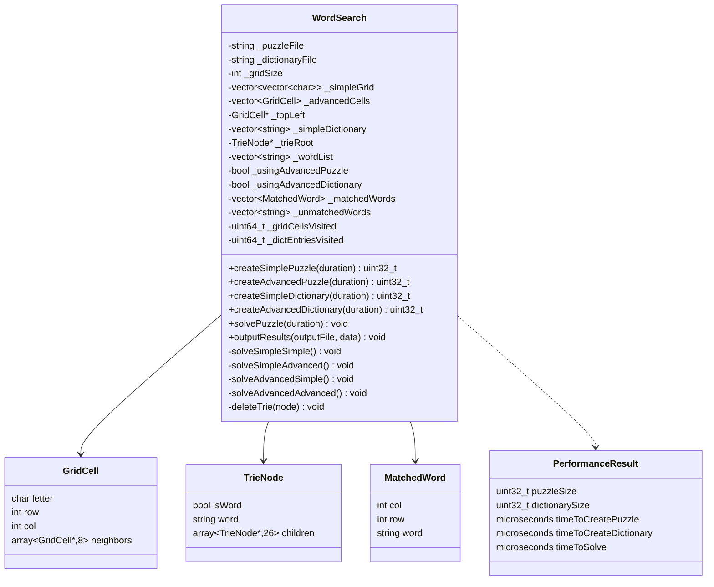

# WordSearch Puzzle Solver — Final Lab

A C++ investigation into alternative data structures for solving WordSearch puzzles. Four combinations of grid and dictionary representations are benchmarked against each other, measuring solve time, memory usage, and visit counts.

---

## Project Structure

```
FinalLab/
├── Main.cpp            # Entry point — runs all four solver configurations
├── WordSearch.h        # Class, struct, and interface declarations
├── WordSearch.cpp      # Method implementations
├── grid.txt            # Input puzzle grid
└── dictionary.txt      # Input word list
```

---

## Building

Requires **Visual Studio 2022** targeting **Windows 11**. No third-party libraries are used — only the C++ standard library.

1. Open the solution in Visual Studio 2022
2. Select the **Release** build configuration (required for accurate performance timing)
3. Build and run

> ⚠️ Do not use the Debug build for benchmarking. Release mode enables compiler optimisations that significantly affect timing results.

---

## How It Works

`Main.cpp` runs four independent solver configurations in sequence. Each creates a fresh `WordSearch` instance, populates one grid structure and one dictionary structure, solves the puzzle, and writes results to a uniquely named output file.

```
grid.txt + dictionary.txt
         │
    ┌────┴────┐
    │ WordSearch │
    └────┬────┘
         │
  ┌──────┴──────┐
  │  solve()    │
  └──────┬──────┘
         │
  ┌──────┴──────────────────────────────────────────┐
  │  simple_puzzle_simple_dictionary.txt             │
  │  advanced_puzzle_simple_dictionary.txt           │
  │  simple_puzzle_advanced_dictionary.txt           │
  │  advanced_puzzle_advanced_dictionary.txt         │
  └─────────────────────────────────────────────────┘
```

---

## Data Structures

### Grid Representations

**Simple Puzzle — `std::vector<std::vector<char>>`**

The grid is stored as a 2D vector, giving direct row/column access. Neighbour positions are recalculated at traversal time. Simple to implement and cache-friendly for row-wise access, but involves repeated boundary checking and index arithmetic during solving.

**Advanced Puzzle — `std::vector<GridCell>` (graph)**

The grid is stored as a flat vector of `GridCell` structs. Each cell holds its letter, coordinates, and **an array of 8 non-owning pointers to its neighbours**, precomputed at construction. Traversal follows these pointers directly with no index arithmetic. This reduces per-step compute cost during solving at the expense of higher memory usage per cell.

```cpp
struct GridCell
{
    char letter = '\0';
    int row = 0;
    int col = 0;
    std::array<GridCell*, 8> neighbors{};
};
```

> Members are ordered `char → int → pointer array` for optimal memory alignment.

---

### Dictionary Representations

**Simple Dictionary — `std::vector<std::string>`**

Words are stored in a flat vector and searched sequentially. No prefix pruning is possible — every candidate sequence must be checked against the full list.

**Advanced Dictionary — Trie (`TrieNode*`)**

A Trie (prefix tree) where each node covers one character and holds up to 26 child pointers. Words are inserted character by character; terminal nodes are marked with `isWord = true` and store the complete word string. During solving, traversal can be **abandoned early** the moment no valid prefix exists — significantly cutting the search space.

```cpp
struct TrieNode
{
    bool isWord = false;
    std::string word;
    std::array<TrieNode*, 26> children{};
};
```

> The Trie root is heap-allocated and **owned** by `WordSearch`. It is recursively deleted in the destructor via `deleteTrie()`.

---

## The Four Solver Configurations

| # | Grid | Dictionary | Output File | Solver Method |
|---|------|------------|-------------|---------------|
| 1 | Simple | Simple | `simple_puzzle_simple_dictionary.txt` | `solveSimpleSimple()` |
| 2 | Advanced | Simple | `advanced_puzzle_simple_dictionary.txt` | `solveAdvancedSimple()` |
| 3 | Simple | Advanced | `simple_puzzle_advanced_dictionary.txt` | `solveSimpleAdvanced()` |
| 4 | Advanced | Advanced | `advanced_puzzle_advanced_dictionary.txt` | `solveAdvancedAdvanced()` |

`solvePuzzle()` dispatches to the correct private method based on the `_usingAdvancedPuzzle` and `_usingAdvancedDictionary` flags, which are set when the respective `create*` methods are called.

---

## Class Reference

### `PerformanceResult`

Plain struct used to pass timing and memory data from `WordSearch` back to `main`.

| Field | Type | Description |
|---|---|---|
| `puzzleSize` | `uint32_t` | Byte size of the grid data structure |
| `dictionarySize` | `uint32_t` | Byte size of the dictionary data structure |
| `timeToCreatePuzzle` | `std::chrono::microseconds` | Grid population time |
| `timeToCreateDictionary` | `std::chrono::microseconds` | Dictionary population time |
| `timeToSolve` | `std::chrono::microseconds` | Puzzle solving time |

---

### `WordSearch`

Declared `final` because its destructor is non-virtual. Follows the **Rule of 5**:

- Copy constructor and copy assignment are **deleted** (owns heap memory via `_trieRoot`)
- Move constructor is defaulted
- Move assignment is declared (implemented in `.cpp`)
- Destructor calls `deleteTrie(_trieRoot)` to safely free Trie memory

#### Public Methods

| Method | Returns | Description |
|---|---|---|
| `WordSearch(puzzleFile, dictionaryFile)` | — | Constructor; stores file paths |
| `createSimplePuzzle(duration)` | `uint32_t` | Populates `_simpleGrid`; sets `_usingAdvancedPuzzle = false` |
| `createAdvancedPuzzle(duration)` | `uint32_t` | Populates `_advancedCells` and links neighbour pointers; sets `_usingAdvancedPuzzle = true` |
| `createSimpleDictionary(duration)` | `uint32_t` | Populates `_simpleDictionary`; sets `_usingAdvancedDictionary = false` |
| `createAdvancedDictionary(duration)` | `uint32_t` | Builds Trie from `_wordList`; sets `_usingAdvancedDictionary = true` |
| `solvePuzzle(duration)` | `void` | Dispatches to the correct private solver; populates `_matchedWords`, `_unmatchedWords`, and visit counters |
| `outputResults(outputFile, data)` | `void` | Writes results to the named file in the required format |

#### Private Members

| Member | Type | Description |
|---|---|---|
| `_puzzleFile` | `const std::string` | Path to puzzle input |
| `_dictionaryFile` | `const std::string` | Path to dictionary input |
| `_gridSize` | `int` | Side length of the square grid |
| `_simpleGrid` | `vector<vector<char>>` | Simple 2D grid |
| `_advancedCells` | `vector<GridCell>` | Flat graph of cells with neighbour pointers |
| `_topLeft` | `GridCell*` | Non-owning pointer to cell at (0,0) in the advanced grid |
| `_simpleDictionary` | `vector<string>` | Flat word list |
| `_trieRoot` | `TrieNode*` | Owning pointer to Trie root |
| `_wordList` | `vector<string>` | Master word list (used by both dictionary builders) |
| `_usingAdvancedPuzzle` | `bool` | Dispatch flag for `solvePuzzle()` |
| `_usingAdvancedDictionary` | `bool` | Dispatch flag for `solvePuzzle()` |
| `_matchedWords` | `vector<MatchedWord>` | Words found in the grid |
| `_unmatchedWords` | `vector<string>` | Words not found |
| `_gridCellsVisited` | `uint64_t` | Total grid cell visits during solve |
| `_dictEntriesVisited` | `uint64_t` | Total dictionary node/entry visits during solve |

---

## UML Class Diagram



---

## Output Format

Each of the four output files must follow this exact format:

```
Number of words matched: n

Words matched in grid:
col row WORD1
col row WORD2

Words unmatched in grid:
WORDn

Number of grid cells visited: n

Number of dictionary entries visited: n

Time to populate grid: t

Time to populate dictionary: t

Time to solve puzzle: t

Size of the grid data structure: b

Size of the dictionary data structure: b
```

- `n` — integer
- `t` — floating-point number in **seconds**
- `b` — integer in **bytes**
- Word positions use **0-based** column, row ordering — e.g. `0 2 HAND` means the word HAND starts at column 0, row 2

---

## Design Notes

**Strengths**
- Clear separation of concerns — grid and dictionary structures are fully independent
- Four explicit solver methods make each code path easy to profile and reason about
- Rule of 5 correctly applied; Trie memory is safely reclaimed via `deleteTrie()`
- Structs are member-ordered for optimal memory alignment
- `WordSearch` declared `final` to prevent unsafe inheritance from a non-virtual destructor

**Weaknesses / Known Limitations**
- Raw `TrieNode*` ownership requires careful manual management; `std::unique_ptr` would be safer
- Four separate solver methods duplicate traversal logic; a strategy pattern would be more maintainable
- Storing a full `std::string word` at each Trie terminal node uses more memory than necessary
- The advanced grid's 8 neighbour pointers per cell can hurt CPU cache performance on large grids

**Potential Improvements**
- Replace raw `TrieNode*` with `std::unique_ptr<TrieNode>` for automatic, exception-safe cleanup
- Introduce a solver strategy interface to eliminate duplicated traversal code
- Store only a word index (into `_wordList`) at Trie terminals rather than the full string
