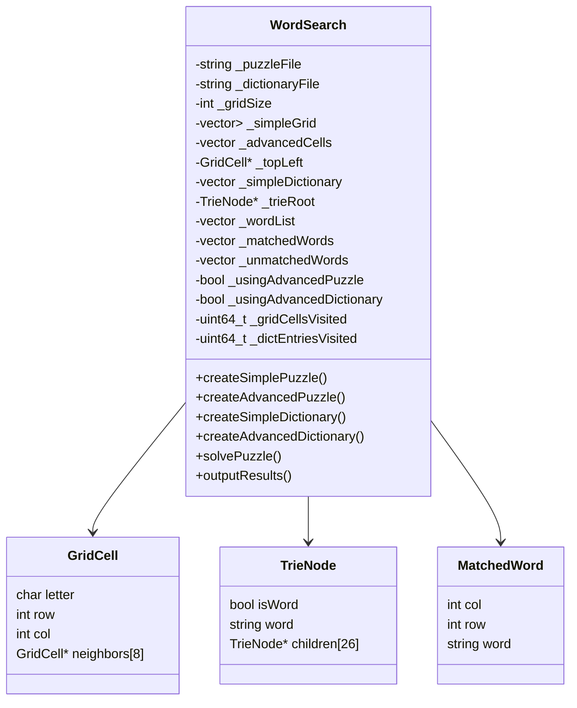
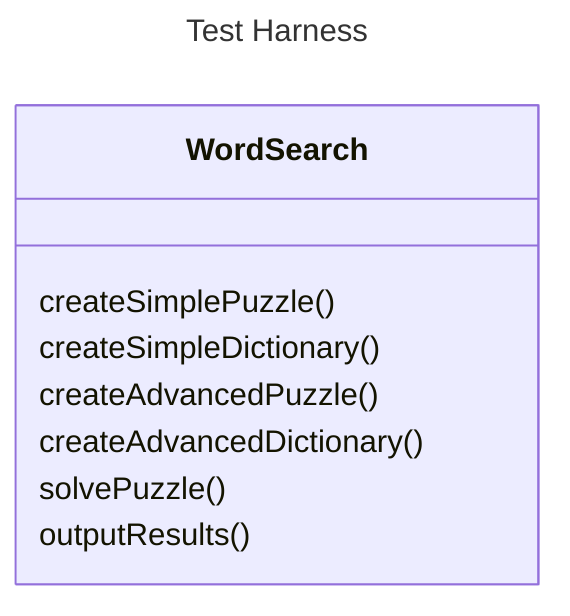

# Final Lab

# Investigation of Alternative Data Structures for WordSearch Puzzles

## Design

This implementation is structured around two primary components: the representation of the puzzle grid and the representation of the dictionary. Each component has both a simple and an advanced implementation, allowing for four distinct combinations. This design enables direct comparison between different data structure strategies and their impact on performance.
The simple puzzle is implemented using a two-dimensional std::vector<std::vector<char>>, providing direct and intuitive access to grid elements via row and column indices. This approach is straightforward and easy to maintain, but requires repeated boundary checking and recalculation of neighbouring positions during traversal.

In contrast, the advanced puzzle representation uses a flattened std::vector<GridCell>, where each GridCell contains not only the letter and its coordinates but also pointers to its eight neighbouring cells. This effectively transforms the grid into a graph-like structure. Traversal operations are simplified by following precomputed neighbour pointers rather than recalculating indices. While this reduces computational overhead during traversal, it increases memory usage due to the storage of multiple pointers per cell.

The dictionary is similarly implemented in two forms. The simple dictionary uses a std::vector<std::string>, where each word is stored independently and processed sequentially. This approach is easy to implement but does not support efficient prefix-based searching, resulting in redundant computations when scanning the grid for each word.

The advanced dictionary employs a Trie data structure, where each node represents a character and contains up to 26 child pointers. Words are inserted character by character, and complete words are marked using a boolean flag. This structure enables efficient prefix-based searching, allowing the algorithm to terminate early when no valid continuation exists. As a result, unnecessary comparisons are significantly reduced.

The system operates by selecting one of four solver strategies depending on the chosen combination of puzzle and dictionary structures. These include simple-simple, simple-advanced, advanced-simple, and advanced-advanced configurations. Each solver method is explicitly implemented, allowing for detailed performance measurement and comparison.

## UML Class Diagram


## Design Critique

The design demonstrates a clear separation of concerns between puzzle representation and dictionary representation. This modularity allows each component to be developed, tested, and optimised independently. Additionally, the use of four distinct configurations enables systematic performance comparison.

A notable strength of the design is the implementation of the Trie structure for the advanced dictionary. This allows for efficient prefix-based searching and significantly reduces unnecessary computations during the solving phase. The inclusion of performance metrics, such as grid cell visits and dictionary entry visits, further enhances the analytical value of the system.

However, several weaknesses are present. The use of raw pointers in the Trie implementation introduces potential risks related to memory management, including memory leaks and undefined behaviour if not handled carefully. Although a recursive deletion function is provided, this approach is less robust than modern alternatives such as smart pointers.

Another limitation is the duplication of logic across the four solver methods. While this makes each approach explicit, it reduces maintainability and increases the likelihood of inconsistencies. Furthermore, the advanced grid structure, while theoretically efficient, introduces significant memory overhead due to the storage of neighbour pointers, which may negatively impact cache performance.

The design could be improved by adopting modern C++ memory management techniques, such as std::unique_ptr, to ensure safer resource handling. Additionally, the introduction of a strategy pattern could eliminate the need for multiple solver methods by encapsulating behaviour in interchangeable components. Reducing redundancy in the Trie structure, for example by avoiding storage of full words at each terminal node, would also improve memory efficiency.

## Performance Analysis

The performance of the system varies significantly depending on the combination of puzzle and dictionary data structures used.

The simple puzzle combined with the simple dictionary represents the least efficient approach. In this configuration, each word in the dictionary is searched independently across the entire grid, resulting in a high number of redundant operations. Both the number of grid cells visited and dictionary entries processed are maximised, leading to poor overall performance.

When the simple puzzle is combined with the advanced dictionary (Trie), performance improves substantially. Instead of searching for each word individually, the algorithm traverses the grid once and builds potential matches incrementally. The Trie enables early termination when a sequence does not correspond to any valid prefix, significantly reducing the search space.

The advanced puzzle combined with the simple dictionary offers modest performance improvements. The use of neighbour pointers simplifies traversal and reduces the computational cost of index calculations. However, these gains are partially offset by increased memory usage and potential cache inefficiencies.

The most efficient configuration is the advanced puzzle combined with the advanced dictionary. This approach leverages both efficient traversal and efficient lookup, minimising redundant operations and achieving the best overall performance. The combination of precomputed neighbour relationships and prefix-based pruning results in a highly optimised solution.

In comparing search strategies, selecting words from the dictionary and searching for them in the grid is generally less efficient than traversing the grid and matching sequences against the dictionary. The former approach leads to repeated scans of the grid, while the latter allows for shared traversal paths and early pruning. The effectiveness of each strategy is strongly influenced by the underlying data structures. In particular, the Trie enables the grid-first approach by supporting efficient prefix matching, whereas a simple vector-based dictionary does not.

## Parasoft C++ Static Test

## Additional Solution

### Bit-parallelism 

## Additional data structures (optional)

One of the marking criteria is the performance of your code, with higher marks being awarded for quicker solutions. Provided you have implemented the FOUR required data structures specified above, then you are free to implement additional data structures, to achieve even faster results.

Bonus marks are available for these additional data structures, based on their complexity and performance.

## Implementation

You are required to develop all four of the above data structures (two 'simple' and two 'advanced') and to operate the WordSearch solving process based on each of FOUR combinations, i.e. simple grid and simple dictionary; simple grid and advanced dictionary; advanced grid and simple dictionary; and advanced grid and advanced dictionary.  For each combination, the program must be run with each of the provided trial puzzles and dictionaries and in each case the operational timings must be recorded by use of suitably positioned timing statements.  The number of words matched, the actual words matched, the total number of grid cells (puzzle letters) compared and the number of dictionary entries (or tree nodes) visited, memory used, along with the overall performance timings must be recorded. See Appendix A for the output format.

These observations should then be evaluated and discussed in your report, to derive conclusions with respect to relative operational behaviour of the different combinations of data structures as well the algorithms involved.

You can use any version of C++, provided your application runs within Visual Studio 2022, on the Windows 11 PCs in FEN-052.

No libraries other than those included with C++ are permitted.  If in doubt, please consult one of the module team.

## Test harness

A test harness has been provided to you.  You are to use this to test your implementation.  If you do not implement the functionality of a particular method listed below, then simply output to the console `std::cout` a message stating that the particular method has not been implemented.  You should assume that the given WordSearch class is not well designed C++, and so you will need to use Parasoft to make sure that your final source code does not violate any Parasoft rules.  Parasoft will be used to mark the quality of your C++ implementation.  Implement the following class and class methods:



### Methods:

- Add any appropriate constructors, destructors or operators

- `void createSimplePuzzle()`: This method will read the puzzle and store the letters in the simple grid data structure.

- `void createSimpleDictionary()`: This method will then read the dictionary and store the words in the simple dictionary data structure.

- `void createAdvancedPuzzle()`: This method will then read the puzzle and store the letters in the advanced grid data structure.

- `void createAdvancedDictionary()`: This method will then read the dictionary and store the words in the advanced dictionary data structure.

- `void solvePuzzle()`: This method will solve the puzzle using the available grid data structure and available dictionary data structure.

- `void outputResults()`: This method will output the results in the format descibed in Appendix A to the appropriately named file (see previously).

## Evaluation

You are required to evaluate your solution from a number of perspectives:

### Performance

The duration (in microseconds), should be recorded for each data structure population and puzzle solver, and printed to the output file.

Marks will be awarded based on these execution times, so effiency fast code is a requirement of this assessment.

Make sure you time your code using the **Release** build in Visual Studio.

### Memory usage

The memory size (in bytes), should be calculated for each data structure, and printed to the output file.

Make use of the `sizeof()`.  

If you are using a `std::vector<>` remember that the size if not just size of the vector, but you'll also need to calculate the sizeof the individual elements, multipled by the number of elements.

### Visit counts

You are required to keep a count of both the number of times grid cells and dictionary entries are visited whilst solving a puzzle.

These two visit counts should be printed to the output file.

### Code quality

You are required to run Parasoft C/C++ Static Test on your codebase.

The generated html report should be uploaded onto your GitHub repo.

You might not agree with all the Parasoft C/C++ Static Test results.  In which case you should document this in your lab book (see below). 

## Code submission

Please ensure the following requirements are met when submitting your source code.

- only submit source code that is used in this application (ie. not all your tutorials)
- clean the solution prior to submission
- ensure that the solution builds
- ensure that Parasoft C++ Static Test runs on the solution

The code can ONLY be submitted via the provided GitHub Classroom repository (ie Lab I (the final lab), a link to which is provided on Canvas)

It is your responsibility to make very sure that all the source code files required to make your application are committed to the GitHub Classroom repository. It's easy to forget to add or push some while you are developing. A good way to check this is to check out your project to a different folder and see if you can build it as follows:

1. Clone your repository in to an empty folder.
2. Open the solution in Visual Studio
3. Run your project(s). Remember that to achieve full marks your submitted code must compile and run.
4. If any of those previous steps doesn't work you probably forgot to add/commit/push one or more of your files. GOTO step 1.

Do not leave it until the last minute to commit and push your work. Committing your repository all in one go may take upwards of an hour to complete. When you do commit your work it is recommended that you include the phrase "ACW FINAL" in the commit log. This indicates that you have made a submission. You can do this multiple times before the deadline if you need to. Submissions made after the deadline will be subject to the usual penalties.

## Lab Book

You are required to add the following to your Lab Book:

### Design - [word limit 1000]

- A brief review of the data structures you have implemented; how are they organised and how are they operated
- UML Class diagram(s) (Hint use Mermaid)
- A critique of the design, including
- - The merits of the design
- - Weaknesses of the design
- - What would you change and why?

### Performance analysis - [word limit 1000]

- For each combination of dictionary and puzzle data structure you have investigated, how does the performance compare with your alternative implementations (this discussion should make reference to your timing and activity results)
- Discuss whether it is more efficient to (a) select words from the dictionary and then search for them in the puzzle grid, or (b) visit each letter in the puzzle grid and attempt to match sequences from that position against the dictionary content.  To what extent are these alternative approaches influenced by the alternative data structure strategies?

### Parasoft C++ Static Test - [word limit 1000]

- Parasoft C++ Static Test results for your source code (in the form of an auto-generated HTML report)
- In cases where you disagree with the Parasoft C/C++ Static Test results, state the rule name and the reason(s) that you do not agree with Parasoft's analysis. 

Lab books can ONLY be submitted via the provided GitHub Classroom repository (ie Lab I (the final lab), a link to which is provided on Canvas)

## Marking Scheme

A detailed marking scheme will be published on Canvas.  This marking scheme will contain a breakdown of all of the marks and allows you to mark yourself as you develop your software and write your report.

# Appendix A : Format of each results file

The following is the format of the results, and the heading names that you MUST have EXACTLY in your output file.

```
Number of words matched: n

Words matched in grid:
n1 n2 WORD1
n1 n2 WORD2
etc.

Words unmatched in grid:
WORDn
etc.

Number of grid cells visited: n

Number of dictionary entries visited: n

Time to populate grid: t

Time to populate dictionary: t

Time to solve puzzle: t

Size of the grid data structure: b

Size of the dictionary data structure: b
```

The headings (in capitals) MUST appear in your results file as shown above.

The `n1 n2 WORD1`, `n1 n2 WORD2` and etc. items denote that these represent all of the words matched in the grid – you will list all of the words here, one word per line.  The `n1` and `n2` before each matched word denotes the column/row position (starting at index 0) of the first letter of the word in the puzzle grid. For example, `0 2 HAND` – denotes that the word HAND was found starting at column=0, row=2 (or x=0, y=2 of the grid).

The `n` represents a single integer number

The `t` represents a single floating-point number in seconds

The `b` represents a single integer value in bytes
